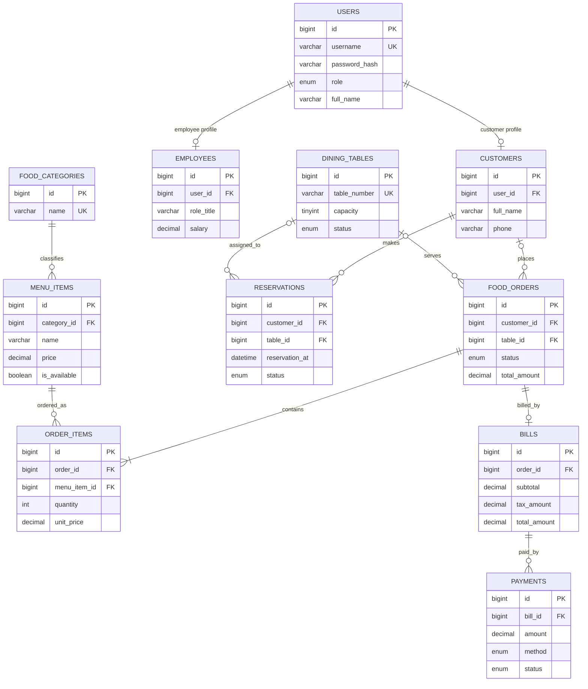

# ER Diagram (Mermaid)
Paste this code into Mermaid Live Editor or a Markdown viewer that supports Mermaid to export the ER diagram image.

```mermaid
erDiagram
  USERS ||--o| CUSTOMERS : "customer profile"
  USERS ||--o| EMPLOYEES : "employee profile"
  FOOD_CATEGORIES ||--o{ MENU_ITEMS : classifies
  CUSTOMERS ||--o{ RESERVATIONS : makes
  DINING_TABLES o|--o{ RESERVATIONS : assigned_to
  CUSTOMERS o|--o{ FOOD_ORDERS : places
  DINING_TABLES o|--o{ FOOD_ORDERS : serves
  FOOD_ORDERS ||--|{ ORDER_ITEMS : contains
  MENU_ITEMS ||--o{ ORDER_ITEMS : ordered_as
  FOOD_ORDERS ||--o| BILLS : billed_by
  BILLS ||--o{ PAYMENTS : paid_by

  USERS {
    bigint id PK
    varchar username UK
    varchar password_hash
    enum role
    varchar full_name
  }
  CUSTOMERS {
    bigint id PK
    bigint user_id FK
    varchar full_name
    varchar phone
  }
  EMPLOYEES {
    bigint id PK
    bigint user_id FK
    varchar role_title
    decimal salary
  }
  DINING_TABLES {
    bigint id PK
    varchar table_number UK
    tinyint capacity
    enum status
  }
  FOOD_CATEGORIES {
    bigint id PK
    varchar name UK
  }
  MENU_ITEMS {
    bigint id PK
    bigint category_id FK
    varchar name
    decimal price
    boolean is_available
  }
  RESERVATIONS {
    bigint id PK
    bigint customer_id FK
    bigint table_id FK
    datetime reservation_at
    enum status
  }
  FOOD_ORDERS {
    bigint id PK
    bigint customer_id FK
    bigint table_id FK
    enum status
    decimal total_amount
  }
  ORDER_ITEMS {
    bigint id PK
    bigint order_id FK
    bigint menu_item_id FK
    int quantity
    decimal unit_price
  }
  BILLS {
    bigint id PK
    bigint order_id FK
    decimal subtotal
    decimal tax_amount
    decimal total_amount
  }
  PAYMENTS {
    bigint id PK
    bigint bill_id FK
    decimal amount
    enum method
    enum status
  }
```
